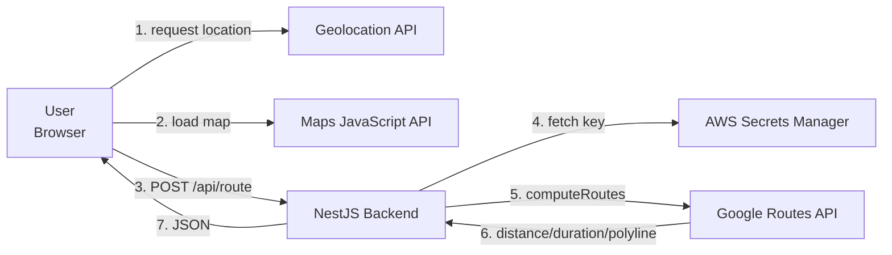

# Requirement — Route to Office

2026-09-18 · @Back-jahjha

## 1. Overview and Objectives

A web application that shows the route, distance, and travel time from the user's current location to the company office, with travel time calculated against live traffic at the moment of the request.

Today anyone travelling to the office has to open Google Maps separately, copy the address across, and search for the route themselves. This system collapses those steps into a single page and a single button.

**Users**

| Group | Usage |
| --- | --- |
| Office visitors | Open the page, grant location access, see the route and travel time |
| System administrators | Set the company coordinates through configuration (no UI in Phase 1) |

**Measurable goals**

- `/api/route` responds within 1.5 seconds at p95 on a cache miss
- Returned travel time reflects real traffic conditions, not a static estimate
- The API key that calls the Routes API never appears in client-side code, under any circumstance
- The API contract is stable enough for the frontend team to build in parallel without waiting

## 2. Phase 1 Scope

This document covers the backend only. The frontend is a separate project with its own specification. Company coordinates come from server-side configuration only; there is no editing screen and no Google Maps link parsing in this phase.

**In scope**

- Accept user coordinates from the client and compute a driving route via the Google Routes API
- Return distance, traffic-aware duration, and an encoded polyline for the frontend to render
- Serve company details and the browser key through dedicated endpoints
- Conceal the server key and load all secrets from AWS Secrets Manager
- Cache results and rate-limit requests to control spend
- Handle unit conversion and display formatting server-side

**Out of scope (deferred)**

| Item | Reason for deferring |
| --- | --- |
| Admin screen for editing company coordinates | Set once and done; configuration is sufficient |
| Pasting a Google Maps link to set the address | The URL structure is undocumented and breaks when Google changes it |
| Multiple office branches | No requirement yet, though the service layer is designed to allow it |
| Other travel modes (walking, transit) | Transit data coverage in Thailand is still incomplete |
| Turn-by-turn directions | The brief asks only for summary figures and the route on the map |
| Authentication and user history | Not needed for the use case |

## 3. System Architecture

One principle shapes the whole design: the key that calls the Routes API must never leave the server. The Maps JavaScript API key cannot be hidden because the browser has to see it, so it is constrained by HTTP referrer restrictions instead.



Steps 1 and 2 belong to the frontend project. Steps 3 through 7 are the scope of this document. The diagram is retained to show what the backend contributes to the overall system.

**API key separation**

| Key | Stored where | Calls | Restrictions |
| --- | --- | --- | --- |
| Browser key | Served to the frontend via `/api/config` | Maps JavaScript API | HTTP referrer limited to our domains; restricted to Maps JS API only |
| Server key | AWS Secrets Manager, read by the backend | Routes API, Geocoding API | Restricted to the Routes API and Geocoding API only; no IP restriction |

A leaked browser key does limited damage because referrer restrictions prevent use from other domains. A leaked server key lets anyone call the Routes API without limit, and that API is billed per request.

**Why the server key is not IP-restricted**

App Runner has no static outbound IP by default. Getting one requires a VPC connector and a NAT gateway, which costs around $32 a month, more than App Runner itself, and is not worth it at this size.

API restriction is used instead: the key is locked to the two named APIs, with the daily quota cap as the ceiling on damage if it leaks. If a VPC connector is ever needed for another reason, an IP restriction can be added then.

**Data flow**

The destination is never sent from the client. The user submits only their own coordinates; the backend reads the destination from its own configuration. This prevents anyone from using our endpoint as a free route calculator between arbitrary points.

## 4. Google Maps APIs

| API | Purpose | Called from | Required for Phase 1 |
| --- | --- | --- | --- |
| Maps JavaScript API | Render the map, markers, and polyline | Frontend | Yes |
| Routes API (`computeRoutes`) | Compute distance, duration, and polyline | Backend | Yes |
| Geocoding API | Convert the office address to coordinates and a place ID | Backend | Once, during setup |

**Why Routes API rather than Directions API**

Routes API is Google's recommended choice for new work and supports field masks, so we request only the fields we actually use and keep the cost down. Directions API still functions but no longer receives new features.

**Parameters that produce real traffic-aware timing**

The brief requires travel time calculated from the current date and time. Three settings must be sent together; omitting any one of them yields a static estimate that ignores traffic.

| Parameter | Value | Effect |
| --- | --- | --- |
| `departureTime` | Current time in RFC 3339 format | Tells Google the trip starts now |
| `routingPreference` | `TRAFFIC_AWARE_OPTIMAL` | Computes with detailed traffic modelling |
| `travelMode` | `DRIVE` | Driving mode |

**Timezone**

Set the environment variable `TZ=Asia/Bangkok` on both App Runner services. Otherwise the container runs in UTC and any timestamp in the logs or responses reads confusingly.

For the `departureTime` sent to Google, `2026-09-18T14:32:10+07:00` and `2026-09-18T07:32:10Z` are the same instant and Google interprets both identically, so the timezone does not affect correctness. It matters for the `computedAt` value returned and for the logs, which should be in Thai local time so they are immediately readable.

**Field mask**

Send the header `X-Goog-FieldMask` as `routes.duration,routes.staticDuration,routes.distanceMeters,routes.polyline.encodedPolyline`. Request only what is used. Do not request `routes.legs`, which returns turn-by-turn data we do not display and inflates the response for nothing.

`staticDuration` is the duration without traffic. We request it to show the user how much worse than usual the traffic currently is.

**Cost control**

Set a GCP budget alert from day one, and set a daily quota limit on the Routes API at roughly three times expected normal usage, so the system stops itself before the bill grows if traffic becomes abnormal.

## 5. Secret Management with AWS Secrets Manager

No API key or confidential configuration value lives in a `.env` file in production. Every value comes from Secrets Manager and is loaded once at startup.

**Secret structure**

Store a single JSON secret named `route-to-office/prod`, so one read fetches everything rather than issuing several calls.

```json
{
  "GOOGLE_MAPS_SERVER_KEY": "AIza...",
  "GOOGLE_MAPS_BROWSER_KEY": "AIza...",
  "COMPANY_NAME": "...",
  "COMPANY_ADDRESS": "...",
  "COMPANY_LAT": "13.7563",
  "COMPANY_LNG": "100.5018",
  "COMPANY_PLACE_ID": "ChIJ..."
}
```

The office coordinates are not secret, but keeping them here means there is one place to change when the office moves, and one configuration mechanism rather than two.

**Loading at startup**

Use `ConfigModule.forRootAsync()` with a factory that calls Secrets Manager, so Nest does not finish bootstrapping until the secrets have loaded, then hold them in memory. Do not call Secrets Manager per request; that costs both latency and money.

Validate immediately after loading. If any key is missing, or `COMPANY_LAT` / `COMPANY_LNG` fall outside valid ranges, exit the process with a clear message. Failing at startup is better than running and breaking when a user presses the button.

**IAM permissions**

The App Runner service's instance role gets `secretsmanager:GetSecretValue` on the ARN of that one secret only. No wildcards, and no access keys baked into the image. Configuration details are in section 10.

**Key rotation**

Google Maps API keys do not support Secrets Manager automatic rotation, so rotation is manual: create a new key in GCP, update the secret, restart the service. Schedule this every 6 months, or immediately on any suspicion of a leak.

**Local development**

Developers should not need production secret access. The config loader reads in this order:

1. If `USE_AWS_SECRETS` is `true`, read from Secrets Manager
2. Otherwise, read from a local `.env` file

The `.env` file must be in `.gitignore`, with a `.env.example` listing every key name and no real values. Each developer uses their own low-quota Google API key during development.

## 6. Backend Requirements (NestJS)

**Project structure**

```
src/
├── main.ts                      # bootstrap, global pipe, global filter
├── app.module.ts
├── config/
│   ├── config.module.ts         # loads secrets at bootstrap
│   └── secrets.service.ts       # reads AWS Secrets Manager + validates
├── route/
│   ├── route.controller.ts      # POST /api/route
│   ├── route.service.ts
│   └── dto/
│       ├── route-request.dto.ts
│       └── route-response.dto.ts
├── company/
│   ├── company.controller.ts    # GET /api/company, GET /api/config
│   └── company.service.ts       # the only place that knows the coordinate source
├── google/
│   └── routes-client.service.ts # calls the Google Routes API
├── common/
│   ├── filters/http-exception.filter.ts
│   └── formatters/units.formatter.ts
└── health/
    └── health.controller.ts     # GET /healthz
```

**Packages**

| Requirement | Package |
| --- | --- |
| Validation | `class-validator` and `class-transformer` via a global `ValidationPipe` |
| Outbound HTTP to Google | `@nestjs/axios` |
| Caching | `@nestjs/cache-manager` with the in-memory store |
| Rate limiting | `@nestjs/throttler` |
| Health checks | `@nestjs/terminus` |
| Reading secrets | `@aws-sdk/client-secrets-manager` |
| API documentation | `@nestjs/swagger`, generating the OpenAPI file for the frontend team |

**Endpoints**

| Method | Path | Purpose |
| --- | --- | --- |
| GET | `/api/config` | Returns the browser key so the frontend can load Maps JS API |
| GET | `/api/company` | Returns office name, address, and coordinates |
| POST | `/api/route` | Accepts user coordinates, returns distance, duration, and polyline |
| GET | `/healthz` | Health check App Runner calls to confirm the service is ready for traffic |

**POST /api/route — request**

```json
{
  "lat": 13.7465,
  "lng": 100.5350
}
```

**POST /api/route — response 200**

```json
{
  "distance": { "meters": 12400, "text": "12.4 km" },
  "duration": { "seconds": 1680, "text": "28 min" },
  "staticDuration": { "seconds": 1200, "text": "20 min" },
  "trafficDelaySeconds": 480,
  "polyline": "ktp~AqvyhVrAaB...",
  "origin": { "lat": 13.7465, "lng": 100.5350 },
  "destination": { "lat": 13.7563, "lng": 100.5018 },
  "computedAt": "2026-09-18T14:32:10+07:00",
  "cached": false
}
```

All fields use camelCase, following TypeScript and NestJS convention. This contract goes to the frontend team after Phase 1 and does not change without notice.

**Validation**

Enforced by `class-validator` on the DTOs, with a global `ValidationPipe` configured with `whitelist: true` and `forbidNonWhitelisted: true` so undeclared fields are rejected rather than silently ignored.

| Rule | Reason |
| --- | --- |
| `lat` between -90 and 90, `lng` between -180 and 180 | Out-of-range values indicate a bug or a probe |
| Distance from the office no more than 500 km | Prevents burning quota on cross-continent coordinates; returns 422 with a message that the location is too far to route |
| Only lat and lng are accepted | Other fields are rejected by forbidNonWhitelisted, keeping the contract explicit and blocking unnecessary data |

The Routes API always returns `routes` as an array. Phase 1 uses the first entry only, since `computeAlternativeRoutes` is not enabled. An empty array means no route was found, and the response is 404.

**Units and formatted text**

Unit conversion and display formatting happen on the backend. Send a `text` field alongside the raw numbers so the frontend does no formatting of its own, and so the format can change later without rebuilding the frontend.

- Distances under 1 km display in metres, e.g. `850 m`
- Distances of 1 km or more display with one decimal, e.g. `12.4 km`
- Durations under 60 minutes display in minutes, e.g. `28 min`
- Durations of 60 minutes or more display as hours and minutes, e.g. `1 hr 15 min`

**company\_service is the single source of truth**

`CompanyService` is the only provider that reaches the office coordinates. It reads the configuration held in memory today. When multiple branches or an admin screen are needed, change the inside of that service to read a database; nothing else moves, because everything already injects the same provider.

## 7. Error Handling and Edge Cases

Every case must return a message ready to display to an end user as-is. Never return raw error codes or Google's own error text. The frontend uses that message field directly and does not have to interpret status codes itself.

**Error responses**

| Case | HTTP status | Response |
| --- | --- | --- |
| Coordinates out of range | 422 | Message that the location is invalid |
| More than 500 km away | 422 | Message that the location is too far to route |
| Google finds no route | 404 | Message that no route to the office was found and another travel method may be needed |
| Routes API returns 4xx | 502 | Generic service-unavailable message, with the real detail logged server-side |
| Routes API times out | 504 | Message that the request took too long, please retry |
| Rate limit exceeded | 429 | Message that requests are too frequent, with a `Retry-After` header |

**Never leak Google's error text to users**

Routes API errors can reveal details about the key or request structure. Catch them in a global exception filter, log them server-side with a request ID, and return only the prepared generic message.

**Timeouts**

| Point | Value |
| --- | --- |
| Backend waiting for Routes API | 8 seconds |
| Backend waiting for Secrets Manager at startup | 5 seconds, 3 retries |

Advise the frontend team to set a client timeout of 15 seconds, comfortably longer than the server-side timeout.

## 8. Non-functional Requirements

**Caching**

The Routes API bills per request, so caching is a cost decision before it is a performance one.

The cache key combines the user's coordinates rounded to 3 decimal places (roughly 110 metre resolution) with a 5-minute time bucket.

```
route:<lat to 3 dp>:<lng to 3 dp>:<floor(epochSeconds / 300)>
```

TTL is 5 minutes. An in-memory cache is used because the system serves tens of users and App Runner is fixed at a single instance. If more instances are ever needed, move to Redis by changing the inside of `cache.service.ts`, since caches split across instances lower the hit rate and return inconsistent results.

Rounding the coordinates lets people in the same area during the same window share a result, which cuts request volume substantially when several users open the page from the same office building or transit station.

**Rate limiting**

| Scope | Limit |
| --- | --- |
| Per IP | 20 requests per minute |
| System-wide | 500 requests per minute |

Set `app.set('trust proxy', 1)` so the real client IP is read from the `X-Forwarded-For` header App Runner sends. Without it, `@nestjs/throttler` sees a single proxy IP and counts every user as one.

**Performance targets**

| Metric | Target |
| --- | --- |
| `/api/route` p95 (cache miss) | Under 1.5 seconds |
| `/api/route` p95 (cache hit) | Under 50 milliseconds |
| `/api/company` and `/api/config` p95 | Under 20 milliseconds, since both read from memory |

**Security**

- Restrict CORS to the frontend domain only, never `*`
- Enforce HTTPS system-wide with an HSTS header
- Do not log user coordinates at full precision; round to 2 decimal places before logging, since location is personal data under PDPA
- Do not persist user coordinates to any database; use and discard
- Set baseline security headers: `X-Content-Type-Options`, `X-Frame-Options`, and a Content-Security-Policy that permits the Google Maps domains

**PDPA compliance**

User coordinates are personal data, so the backend uses them for the calculation and discards them: never written to a database, never logged at full precision.

Showing the notice before requesting location permission is the frontend's responsibility, but it must match what is stated here: used only to calculate the route, not stored, not shared with third parties.

**Logging and monitoring**

- Log every request as structured JSON with a request ID
- Count Routes API calls per day for reconciliation against the bill
- Alert when the error rate exceeds 5% over 5 minutes, or when Routes API calls exceed the configured ceiling

## 9. Authentication and Access Control

This API has no login, and should not have one. It serves a public page for people travelling to the office. Requiring a login before showing the route would send users straight back to Google Maps, defeating the purpose of building it.

The real problem is not identifying who someone is. It is preventing anyone from burning through our Google quota, and authentication does not solve that. Layered access restriction does.

**What not to do**

Never embed a token or secret in the frontend hoping to gate the API. Anyone who opens developer tools can read it. Measures like this create a false sense of security and lead to neglecting the ones that work.

**Protection layers for the public endpoint**

| Measure | Protects against | Phase 1 status |
| --- | --- | --- |
| GCP daily quota cap | The final ceiling guaranteeing the bill cannot exceed a set amount, no matter the attack volume | Included |
| Per-IP rate limit | Rapid requests from a single source | Included (section 8) |
| Domain-restricted CORS | Other sites calling through a browser | Included (section 8) |
| `Origin` header check on `/api/config` | Harvesting the browser key for use elsewhere | Included |
| Cloudflare Turnstile or CAPTCHA | Scripted bot traffic | Deferred, pending log review |
| WAF or edge rate limiting | Cuts traffic before it reaches the server, at lower cost | Deferred |

The quota cap is the only measure that genuinely guarantees a spending ceiling. The rest reduce nuisance traffic and server load.

**Approach**

Phase 1 ships with the quota cap, rate limiting, CORS, and the Origin header check. Monitor logs for around two weeks; if abnormal usage appears, add Turnstile, which takes roughly half a day and requires nothing extra from ordinary users.

**Admin authentication (Phase 2)**

Real authentication becomes necessary once there is a screen for editing office coordinates or managing multiple branches, because that introduces write operations.

| Option | Suitable when |
| --- | --- |
| Office IP allowlist or VPN | Few administrators, all working from the office; simple and sufficiently secure |
| AWS Cognito | Already on AWS; brings MFA and session management with it |
| Existing company SSO (Google Workspace or Microsoft 365) | Already in place, no extra accounts to manage |

Do not build authentication in-house. Do not create a users table with self-managed password hashes; the risk is not worth it for a handful of administrators. If the company already runs Google Workspace or Microsoft 365, connecting SSO is both the fastest and the safest route.

## 10. Deployment and Environment

**Environments**

| Environment | Secret name | Domain |
| --- | --- | --- |
| Local | `.env` file | `localhost` |
| Staging | `route-to-office/staging` | Staging domain |
| Production | `route-to-office/prod` | Production domain |

Each environment uses a separate set of Google API keys, so referrer restrictions and quotas stay independent and spend can be attributed to its source.

**Runtime: AWS App Runner**

App Runner is chosen because it manages HTTPS and certificates itself and attaches an IAM role without requiring a VPC, ALB, or target group, none of which are worth configuring for a system this size.

The backend builds as a multi-stage Docker image: the first stage runs `npm ci` and `nest build`, the second copies only `dist/` and production dependencies, keeping the image small and cold starts fast. No secrets go into the image through either ARG or ENV; everything is read from Secrets Manager at runtime.

| Setting | Value | Reason |
| --- | --- | --- |
| Source | ECR image, or connect a GitHub repo and build from the Dockerfile | Either works; GitHub is simpler to set up |
| Port | 3000 | Nest's default, configurable through `PORT` |
| Health check path | `/healthz` | Already defined in section 6 |
| Auto scaling min / max | 1 / 1 | The in-memory cache requires a single instance, otherwise each holds its own copy |
| Instance role | `secretsmanager:GetSecretValue` on that environment's secret ARN only | Used at runtime |

**Common mistake: App Runner has two roles**

App Runner separates the access role from the instance role. The access role is used to pull the image from ECR; the instance role is what the running code uses to call AWS.

`secretsmanager:GetSecretValue` must sit on the **instance role**. Attached to the access role by mistake, the service deploys successfully and then crashes at startup with AccessDenied, which is hard to diagnose because the IAM setup looks correct at a glance.

Each environment is a separate App Runner service, pointing at its own secret ARN with its own instance role.

**Pre-deployment checklist**

- [ ] Create the GCP project and enable Maps JavaScript API, Routes API, Geocoding API
- [ ] Create two API keys and apply restrictions to both
- [ ] Set a budget alert and a daily quota limit in GCP
- [ ] Obtain the office coordinates and place ID
- [ ] Create the secrets in AWS Secrets Manager for staging and production
- [ ] Create an instance role per App Runner service, scoped to the matching secret ARN
- [ ] Create both App Runner services with the port, health check, and scaling settings above
- [ ] Add both App Runner default domains to the browser key's referrer restrictions

**Finding the coordinates and place ID**

Open Google Maps and right-click the office location. The numbers at the top are latitude and longitude, and clicking copies them. For the place ID, use Google's Place ID Finder, or call the Geocoding API once with the office address and store the result.

When a place ID is available, send it as the destination instead of raw coordinates. Google knows where the building entrance is, so the route will not terminate in the middle of a block or on the wrong side of the road.

## 11. Timeline

Roughly 2.5 working days for one developer, backend only.

| Phase | Work | Duration | Deliverable |
| --- | --- | --- | --- |
| 0 | Set up GCP project, create keys, create AWS secrets, set budget alerts, scaffold the repo | 0.5 day | A project that starts and reads secrets successfully |
| 1 | Config loader, `/api/config`, `/api/company`, `/api/route`, routes\_client, validation, formatting | 1 day | All endpoints verified through Swagger |
| 2 | Cache, rate limiting, Origin check, security headers, error handling, logging | 0.5 day | An API ready for real traffic |
| 3 | Staging deploy, end-to-end testing, hand the API documentation to the frontend team | 0.5 day | API live on staging and callable by the frontend |

**Recommended sequence**

Settle the API contract in section 6 first, then hand it to the frontend team immediately so they can mock against the real schema and build in parallel rather than waiting for the backend.

After Phase 1, expose Swagger or share the OpenAPI file as the shared contract. Any schema change after that point must be announced to both teams at once.

**Risks that could cause slippage**

| Risk | Impact | Mitigation |
| --- | --- | --- |
| Waiting on GCP project or billing account access | Blocks everything | Request access on day one, before writing code |
| Waiting on AWS secret and IAM role permissions | Blocks Phase 0 | Develop against `.env` first, switch later |
| Secrets Manager permission attached to the access role by mistake | Deploys fine, then crashes at startup and is hard to diagnose | Verify the instance role before deploying, per section 10 |
| Google changes the Routes API response shape | The system breaks silently | Pin `X-Goog-FieldMask` and test against a recorded sample response |

## 12. Open Decisions

Points the brief does not specify that affect the design.

| Question | Options | Effect on the work |
| --- | --- | --- |
| Frontend domain | Same domain as the backend, or a separate one | Affects CORS and Origin check configuration |
| English language support | Thai only, or bilingual | If bilingual, the backend must accept a locale and return messages in the requested language |
| Custom domain or App Runner default domain | `xxx.awsapprunner.com` or a company domain | A custom domain needs DNS records and a certificate wait |

**Already decided in this document**

- This document covers the backend only; the frontend is a separate project
- Deployed on AWS App Runner, with separate services for staging and production
- The system is sized for tens of users, so an in-memory cache on a single instance is sufficient and Redis is not needed
- Office coordinates are a single fixed value from configuration; no admin screen and no Google Maps link parsing in Phase 1
- Driving mode only
- Returns summary figures and a polyline only, no turn-by-turn directions
- All secrets come from AWS Secrets Manager on staging and production
- Returns a single route; computeAlternativeRoutes stays off, since visitors want one answer about travel time rather than a comparison of routes
